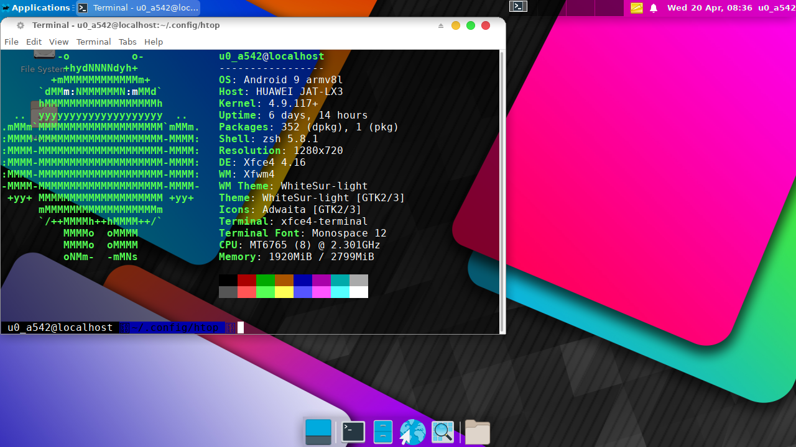
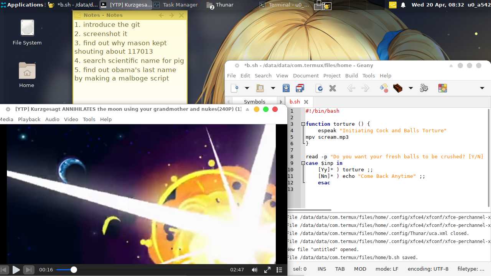
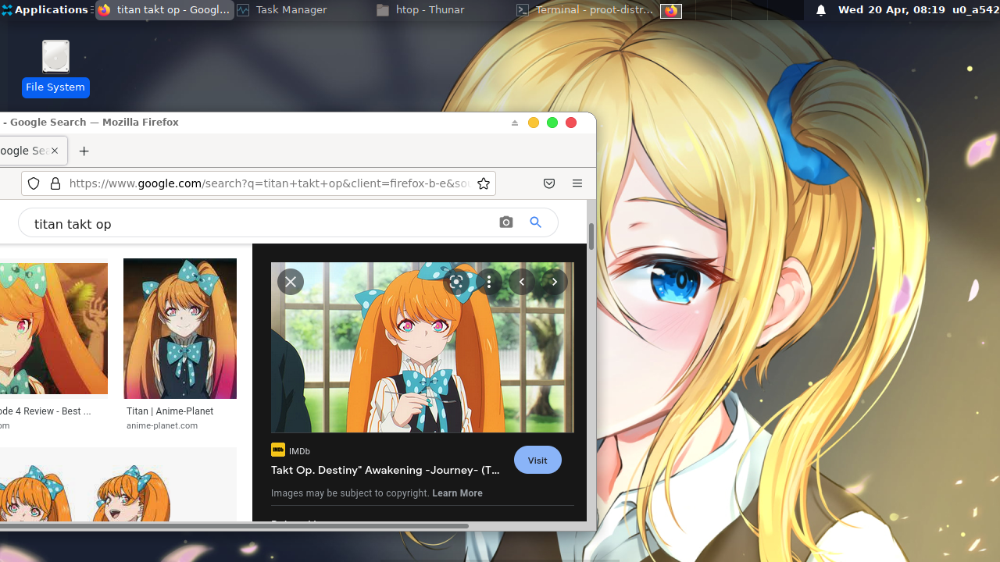

# Termux-XFCE WhiteSur Theme

 

An XFCE WhiteSur theme for Termux Edition, with thanks to vince here

Warning, if you clone this project, you need a better internet connection, this Package has a size of **90MB**

[Sauce to the Theme](https://github.com/vinceliuice/WhiteSur-gtk-theme)

This iz just my Open Inspiration to Yisus7u7's XFCE

[Get the Yisus7u7's Version](https://github.com/Yisus7u7/termux-desktop-xfce/blob/main/README-en.md)

And seriously its effing hard to port this.

## Run

```
chmod u+x *.sh && bash bootstrap.sh
```

## Want to help fixing bugs? Run this and give details about issues

```
chmod u+x *.sh  &&  chmod u+x libvnc/*.sh  && bash -vvvv bootstrap.sh
```

## Fixes and Additions

 - Ncurses added
 - Added ability to install Debian Automatically (Debian is good at ARM than Ubuntu in some areas [LLVMPIPE port])
 - Fix towards icon.sh stuck on loop
 - Fix when Rem (ReZero) Did not get extracted ~~i forgor about rem~~ its just a typo error in the script.
 - Fix when SpyXFamily Images didn't get included ~~i forgor the same damn thing~~ lines of code for it was missing
- Fix when installing icons, Causes the Android OS to go Kernel Panic (Holy Shit) so to see if the tar is really doing something, its now activates under verbose mode


## Supported themes

- WhiteSur Light and Dark (Basic)

## Plans

- ~~Adding Fonts~~ (Its unavailable)

## Problems in Beta Phase

- When installing cursor, it may get stuck at TigerVNC cursor, please go to settings and manually set it up, but the cursors are already installed, you just need to activate it


## Images


*main screen with material wallpaper*

### And some Other Screenshots





## To Run Distro Related Process

To run a Distro, type `distrolaunch`, it will ask you what distro are you trying to execute, type `debian` and it will take you there ,

or use `proot-distro` instead

## App not supported on Termux, Run this when on Proot;

```
export DISPLAY=:1
firefox-esr
```

Tada!! It will try to tunnel the process to the Termux X11
